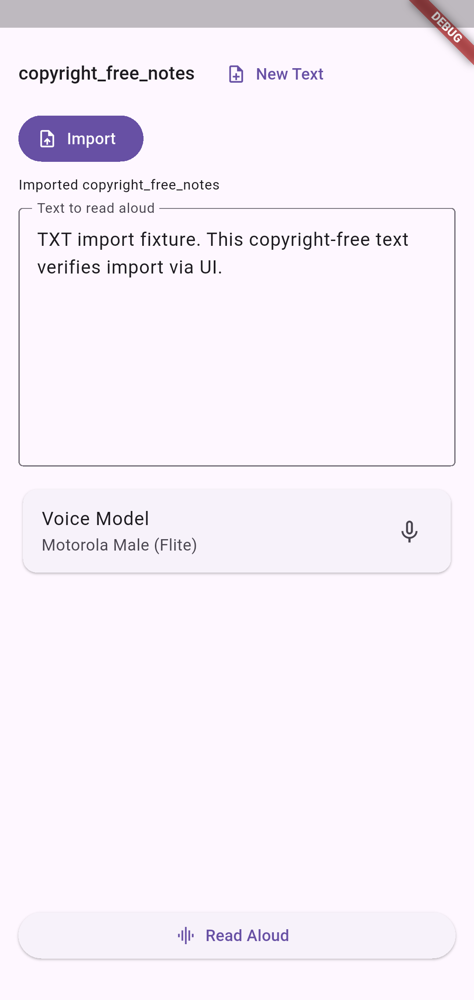
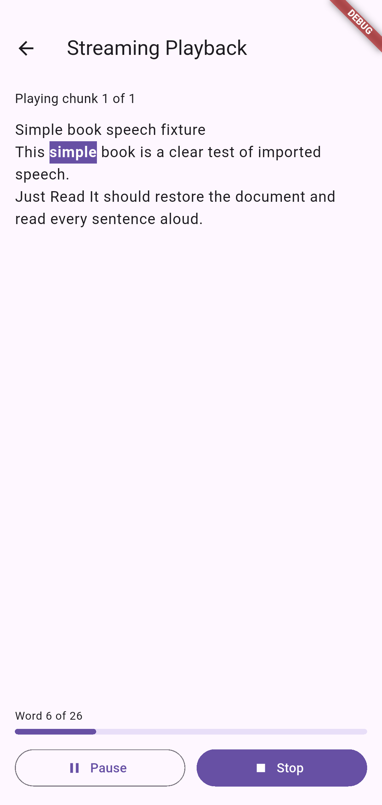

# Just Read It

**Just Read It** is a Flutter + Rust read-aloud app for turning long-form text into a hands-free listening experience with synchronized word highlighting and native media controls.

The project focuses on passive, phone-based TTS workflows: import text, start playback, and keep listening while walking, commuting, cooking, or otherwise using the phone hands-free. It is cross-platform for Android and iOS and ships persistent document storage, native file import, real synthesized audio playback, background/media controls, and per-voice adjustable speech settings.

<p align="center">
  
  
</p>

## Architecture

```text
just-read-it/
├── flutter_client/         # Flutter app, Riverpod state, document import, UI, audio service
├── rust_core/              # Rust synthesis/audio core exposed through Flutter Rust Bridge
├── tools/                  # Validation and project automation scripts
└── docs/                   # Architecture, validation, roadmap, and README assets
```

Further technical notes:

- [Runtime pipeline](docs/runtime-pipeline.md)
- [Validation guide](docs/validation.md)
- [Release workflow](docs/releases.md)
- [Roadmap](docs/roadmap.md)

## Import support

Supported extensions:

- `.txt`
- `.text`
- `.md`
- `.markdown`
- `.epub`

EPUB import extracts readable XHTML/HTML content from the archive and strips markup into plain text for playback.

## Build prerequisites

- Flutter stable with Android SDK/NDK configured for Android builds.
- macOS with Xcode for iOS simulator/device builds.
- Rust stable.
- `cargo-ndk` for Android Rust library builds.
- Apple Rust targets for iOS builds (`aarch64-apple-ios`, `aarch64-apple-ios-sim`; `x86_64-apple-ios` when building Intel simulator slices).
- `flutter_rust_bridge_codegen` matching the pinned Flutter/Rust bridge runtime.

```bash
cargo install cargo-ndk --locked
cargo install flutter_rust_bridge_codegen --version 2.11.1 --locked
```

## Bootstrap

```bash
cd flutter_client
flutter pub get
```

Regenerate Flutter ↔ Rust bindings when bridge APIs change:

```bash
flutter_rust_bridge_codegen generate
```

Or use the project helper when appropriate:

```bash
./tools/build_all.sh codegen
```

## iOS build

The iOS app links the Rust Flite bridge as a static library from an Xcode build phase. Current iOS support is implemented and validated in CI for simulator parity, including screenshots, synthesized WAV/STT checks, and background media behavior. On macOS with Xcode installed, the Flutter build invokes `flutter_client/tool/ios_build_rust_core.sh` automatically:

```bash
cd flutter_client
flutter build ios --simulator --debug
```

For a signed development build on a physical iPhone, open `flutter_client/ios/Runner.xcworkspace` in Xcode, configure your bundle identifier/development team, and run the `Runner` scheme on the device. iOS remains in development/alpha status rather than App Store-ready release status.

## Android build

Build the Rust shared library for Android ARM64:

```bash
cd rust_core
cargo ndk -t arm64-v8a \
  -o ../flutter_client/android/app/src/main/jniLibs \
  build --no-default-features --features bridge,flite
```

Build a debuggable APK:

```bash
cd ../flutter_client
flutter build apk --debug --target-platform android-arm64
```

The APK will be written to:

```text
flutter_client/build/app/outputs/flutter-apk/app-debug.apk
```

## License

Apache-2.0. See [LICENSE](LICENSE).
