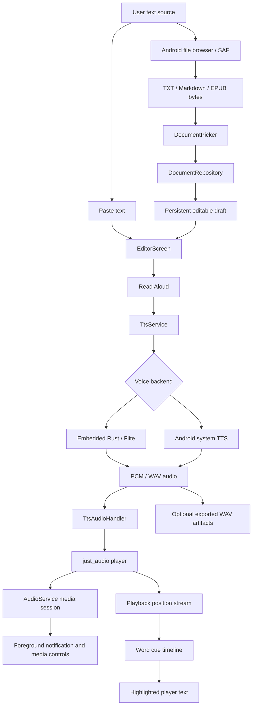

# Runtime pipeline

Just Read It is structured around a document-first playback pipeline: import or paste text, keep it editable, synthesize speech, then drive native audio playback and visual highlighting from the same text model.

## Document import

- `NativeDocumentPicker` wraps `file_picker` and requests TXT, Markdown, and EPUB-style extensions.
- Android imports use the platform document picker, so content-provider files can be opened without direct filesystem paths.
- `DocumentRepository.importBytes` normalizes provider bytes into a `ReaderDocument` and persists the active draft.
- EPUB import extracts readable XHTML/HTML entries from the archive and strips markup into editable plain text.

## Editing and persistence

The editor is intentionally simple: one active document, editable text, persisted title, and persisted content. This keeps the mobile reading flow fast while leaving room for a fuller library/index model later.

## Speech synthesis

`TtsService` owns synthesis orchestration. It selects the configured voice backend, chunks long text when needed, writes or receives playable audio, and attaches a word timeline for highlighting.

Supported active paths:

- **Embedded Flite via Rust** for offline bundled speech.
- **Android system TTS** for device-native speech synthesis and CI stability.

## Playback and highlighting

`TtsAudioHandler` uses `just_audio` for playback and `audio_service` for native media integration. Playback position updates feed word-cue lookup, which updates the highlighted word in the player screen.

## Test artifacts

The emulator flow can export WAV files after native playback starts. Those artifacts prove the app produced and played real audio through the media stack rather than only updating UI state.
